# SKA Batch Backtest — Paired Cycle Trading (PCT)

## Framework

**Entropic Trading** — uses entropy dynamics as the signal axis instead of price.
The signal is derived from the market's own learning process (SKA — Structured Knowledge Accumulation), not from price levels or volume.

**Paired Cycle Trading (PCT)** — entry and exit defined by paired regime transitions in the TradeID Series.
The bot is structurally blind to the neutral→neutral baseline (90% of trades) by design.
Only the 4 directional transitions carry signal:

```
neutral→bull   bull→neutral   neutral→bear   bear→neutral
```

This is not HFT. It is event-driven structural trading operating at tick data resolution.

---

## Bot v1 — Consecutive same-direction paired cycles, symmetric exit

```
LONG:   neutral→bull              (OPEN — WAIT_PAIR)
        bull→neutral              (pair confirmed — IN_NEUTRAL)
        neutral→neutral × N       (count all — stay IN_NEUTRAL)
        <first non-neutral>       (gap closes — READY)
        neutral→bull              (cycle repeats — back to WAIT_PAIR)
        ...
        neutral→bear              (opposite cycle opens — EXIT_WAIT)
        bear→neutral              (opposite pair confirmed — CLOSE LONG)

SHORT:  neutral→bear              (OPEN — WAIT_PAIR)
        bear→neutral              (pair confirmed — IN_NEUTRAL)
        neutral→neutral × N       (count all — stay IN_NEUTRAL)
        <first non-neutral>       (gap closes — READY)
        neutral→bear              (cycle repeats — back to WAIT_PAIR)
        ...
        neutral→bull              (opposite cycle opens — EXIT_WAIT)
        bull→neutral              (opposite pair confirmed — CLOSE SHORT)
```

State machine: WAIT_PAIR → IN_NEUTRAL → READY → EXIT_WAIT → CLOSE.

The alpha: the market generates consecutive same-direction paired cycles.
Hold through all of them — close only when the opposite paired cycle fully confirms.
Entry and exit require identical structural confirmation — a complete paired cycle.
The neutral gap (neutral→neutral × N) is counted per cycle as `nn_count`.

---

## Signal Logic — Mermaid Diagram

```mermaid
flowchart TB
    title["SKA Paired Cycle Trading — v1 Signal Logic"]

    note["v1 — Consecutive same-direction paired cycles<br/>Hold through repeated same-direction cycles — close only when opposite paired cycle confirms"]

    title --> note

    subgraph LONG["LONG"]
        direction LR
        L1["neutral→bull<br/><i>OPEN / WAIT_PAIR</i>"]
        L2["bull→neutral<br/><i>pair confirmed / IN_NEUTRAL</i>"]
        L3["neutral→neutral × N<br/><i>neutral gap / READY</i>"]
        L4["neutral→bear<br/><i>opp. cycle opens / EXIT_WAIT</i>"]
        L5["bear→neutral<br/><i>opp. pair confirmed / CLOSE LONG</i>"]

        L1 --> L2 --> L3 --> L4 --> L5
        L3 -. "↺ repeats" .-> L1
    end

    subgraph SHORT["SHORT"]
        direction LR
        S1["neutral→bear<br/><i>OPEN / WAIT_PAIR</i>"]
        S2["bear→neutral<br/><i>pair confirmed / IN_NEUTRAL</i>"]
        S3["neutral→neutral × N<br/><i>neutral gap / READY</i>"]
        S4["neutral→bull<br/><i>opp. cycle opens / EXIT_WAIT</i>"]
        S5["bull→neutral<br/><i>opp. pair confirmed / CLOSE SHORT</i>"]

        S1 --> S2 --> S3 --> S4 --> S5
        S3 -.-> S1
    end

    note --> LONG
    note --> SHORT

    classDef longOpen fill:#A8DFBC,stroke:#AAAAAA,color:#000,stroke-width:1.5px;
    classDef longPair fill:#C8F0A8,stroke:#AAAAAA,color:#000,stroke-width:1.5px;
    classDef shortOpen fill:#FFAAAA,stroke:#AAAAAA,color:#000,stroke-width:1.5px;
    classDef shortPair fill:#FFD0A0,stroke:#AAAAAA,color:#000,stroke-width:1.5px;
    classDef neutral fill:#E8E8E8,stroke:#AAAAAA,color:#000,stroke-width:1.5px;
    classDef meta fill:#FFFFFF,stroke:#FFFFFF,color:#222;

    class title,note meta;
    class L1 longOpen;
    class L2 longPair;
    class L3 neutral;
    class L4 shortOpen;
    class L5 shortPair;
    class S1 shortOpen;
    class S2 shortPair;
    class S3 neutral;
    class S4 longOpen;
    class S5 longPair;
```



---

## Data

- Source: Binance XRPUSDT WebSocket — real tick data exported from QuestDB
- Folder: `XRPUSDT/` — 20 files, July 2025
- Liquidity: ~875 trades/minute (high liquidity period)
- Each file: ~2300–4500 trades, 2–20 minutes of market activity
- Entropy computed by the SKA learning engine (matrix grows 1×1 → N×N per loop)

---

## Backtest Results

### July 2025 — 20 files (reference dataset)

| Trades | Win%  | Total PnL | Avg PnL/trade | Force closes |
|--------|-------|-----------|---------------|--------------|
| 516    | 66.9% | +0.1635   | +0.000317     | 20           |

### March 2026 — 87 live files

| Trades | Win%  | Total PnL | Avg PnL/trade | Force closes |
|--------|-------|-----------|---------------|--------------|
| 2504   | 56.1% | +0.3639   | +0.000145     | 87           |

### Live — 2026-03-16 (2 loops)

| Trades | Win%  | Total PnL | Avg PnL/trade |
|--------|-------|-----------|---------------|
| 25     | 80.0% | +0.007600 | +0.000304     |

### Per file — July 2025

| File | Trades | Win% | PnL | Force |
|------|--------|------|-----|-------|
| questdb-query-1751814162388.csv | 24 | 70.8% | +0.008900 | 1 |
| questdb-query-1751823646841.csv | 31 | 54.8% | +0.004800 | 1 |
| questdb-query-1751880848676.csv | 23 | 60.9% | +0.003100 | 1 |
| questdb-query-1751909192925.csv | 23 | 73.9% | +0.009100 | 1 |
| questdb-query-1751924112805.csv | 13 | 38.5% | +0.002200 | 1 |
| questdb-query-1751958417525.csv | 21 | 57.1% | +0.000400 | 1 |
| questdb-query-1751984700242.csv | 23 | 65.2% | +0.006800 | 1 |
| questdb-query-1751987436731.csv | 31 | 67.7% | +0.005800 | 1 |
| questdb-query-1751990194216.csv | 32 | 78.1% | +0.015600 | 1 |
| questdb-query-1751993844367.csv | 31 | 77.4% | +0.010100 | 1 |
| questdb-query-1752000467711.csv | 26 | 80.8% | +0.009700 | 1 |
| questdb-query-1752003744108.csv | 21 | 57.1% | +0.008100 | 1 |
| questdb-query-1752056238892.csv | 22 | 59.1% | +0.004500 | 1 |
| questdb-query-1752059055042.csv | 22 | 63.6% | +0.008200 | 1 |
| questdb-query-1752255003359.csv | 36 | 77.8% | +0.016400 | 1 |
| questdb-query-1752509592905.csv | 24 | 79.2% | +0.017300 | 1 |
| questdb-query-1753534868337.csv | 20 | 35.0% | +0.000300 | 1 |
| questdb-query-1753551814823.csv | 25 | 76.0% | +0.011900 | 1 |
| questdb-query-1753564543126.csv | 34 | 70.6% | +0.014200 | 1 |
| questdb-query-1753612688661.csv | 34 | 61.8% | +0.006100 | 1 |
