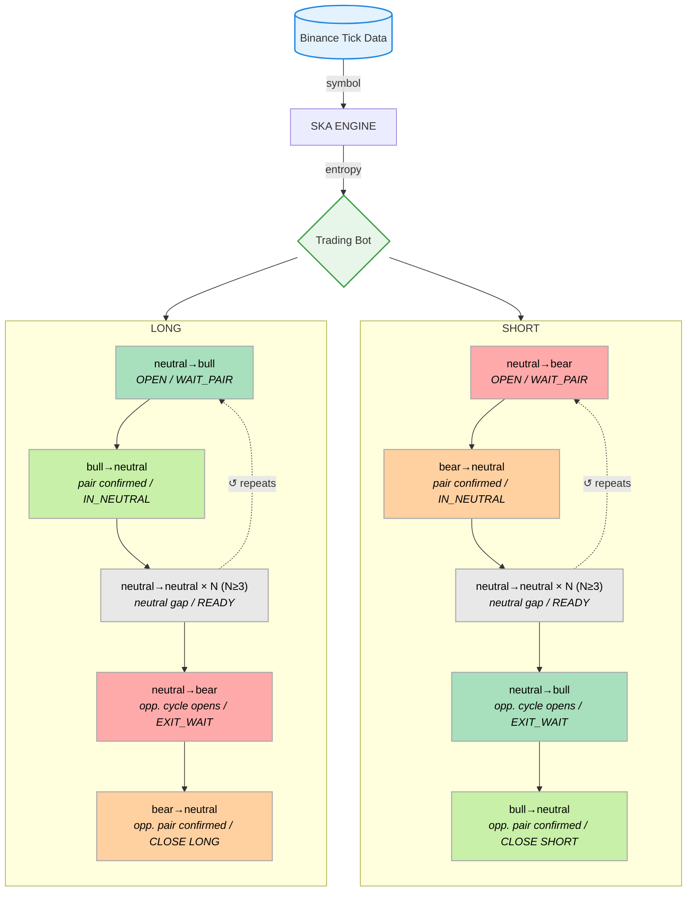

# SKA Batch Backtest — Paired Cycle Trading (PCT)

## Framework

**Entropic Trading** — uses entropy dynamics as the signal axis instead of price.
The signal is derived from the market's own learning process (SKA — Structured Knowledge Accumulation), not from price levels or volume.

**Paired Cycle Trading (PCT)** — entry and exit defined by paired regime transitions in the TradeID Series.
The bot is structurally blind to the neutral→neutral baseline (90% of trades) by design.
Only the 4 directional transitions carry signal:

```
neutral→bull   bull→neutral   neutral→bear   bear→neutral
```

This is not HFT. It is event-driven structural trading operating at tick data resolution.

---

## Bot v3 — ΔP band regime, entropy-derived probability

```
Regime definition:
  P(n)   = exp(-|ΔH/H|)         where ΔH/H = (H(n) - H(n-1)) / H(n)
  ΔP(n)  = P(n) - P(n-1)

  |ΔP − (−0.86)| ≤ 0.0042  →  regime = 2  (bear)
  |ΔP − (−0.34)| ≤ 0.0198  →  regime = 1  (bull)
  else                       →  regime = 0  (neutral)

P band positions — universal constants at convergence scale:
  P_NEUTRAL_NEUTRAL = 1.00
  P_NEUTRAL_BULL    = 0.66
  P_X_NEUTRAL       = 0.51   (bull→neutral = bear→neutral)
  P_NEUTRAL_BEAR    = 0.14

Exit filter: abs(P - 0.51) ≤ 0.0153  (TOL_CLOSE)
```

```
LONG:   neutral→bull              (OPEN — WAIT_PAIR)
        bull→neutral              (pair confirmed — IN_NEUTRAL)
        neutral→neutral × N≥3    (neutral gap — READY)
        neutral→bear              (opposite cycle opens — EXIT_WAIT)
        bear→neutral + TOL_CLOSE  (CLOSE LONG)

SHORT:  neutral→bear              (OPEN — WAIT_PAIR)
        bear→neutral              (pair confirmed — IN_NEUTRAL)
        neutral→neutral × N≥3    (neutral gap — READY)
        neutral→bull              (opposite cycle opens — EXIT_WAIT)
        bull→neutral + TOL_CLOSE  (CLOSE SHORT)
```

State machine: WAIT_PAIR → IN_NEUTRAL → READY → EXIT_WAIT → CLOSE.

Additional guards:
- `MIN_TRADES = 60` — no trade until 60 entropy-valid ticks (SKA convergence warmup)
- Direct jump filter — `bull→bear` and `bear→bull` ignored (localized entropy shocks)

---

## Signal Logic — Diagram



---

## Data

- Source: Binance XRPUSDT WebSocket — real tick data exported from QuestDB
- Folder: `XRPUSDT/` — 112 files, March 28–29 2026
- Liquidity: ~700 trades/5 min (low liquidity period)
- Each file: ~3500 trades per loop
- Entropy computed by the SKA learning engine (matrix grows 1×1 → 3500×3500 per loop)

---

## Backtest Results

### March 2026 — 112 loops, XRPUSDT, bot v3

| Metric | Value |
|---|---|
| Loops | 112 |
| Total trades | 2979 |
| Winners | 1293 |
| Losers | 1170 |
| Flat | 516 |
| Win rate | 43.4% |
| Total PnL | **+3334 pips** |
| Avg / trade | **+1.12 pips** |
| LONG (spot) | +1780 pips |
| SHORT (synth) | +1554 pips |
| Best loop | +103 pips (13 trades, avg +7.92) |
| Worst loop | -69 pips (10 trades, avg -6.90) |
| Force closes | 102 |

> Consistent with live bot: 41 live loops = win 43.3%, avg +1.17 pips.


---

## Usage

```bash
# Run backtest on all files in XRPUSDT/
/opt/venv/bin/python3 backtest.py

# Print formatted report from summary.csv
/opt/venv/bin/python3 report.py
```
