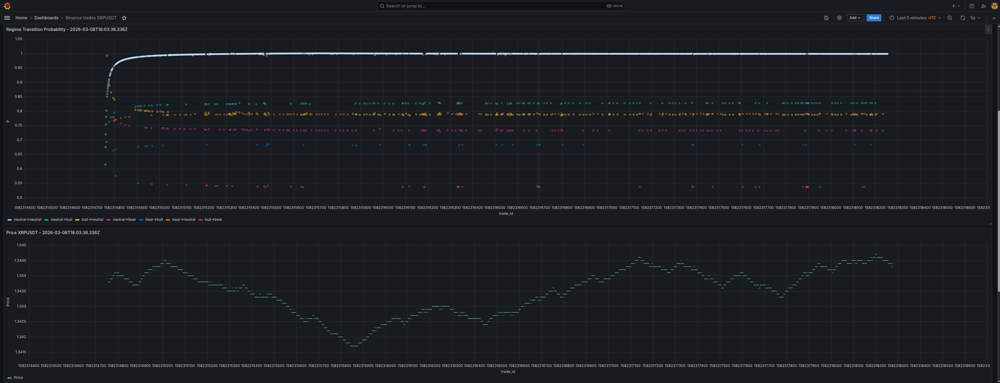

# SKA Trading Bot Results

## v1 — Single confirmation exit (14 loops, 282 trades)

- Total PnL: 0.000000 — perfectly flat
- Win rate: 25.9% — low but improving over time (loops 9-14 are better)
- LONG: +0.0043, SHORT: -0.0043 — symmetric, cancels out
- Best trade: +0.0041, Worst: -0.0009 — winners are 4x bigger than losers

Interesting pattern: early loops lose, later loops win. Loops 1-6 are negative, loops 7-14 trend positive. The later runs have fewer trades but higher win rate (37-100%).

This suggests:
1. The bot trades too often in high-activity periods (noise)
2. When it trades less frequently, it catches real cycles
3. A minimum time between trades or P threshold filter would cut the noise and keep the winners

The alpha is there — the later loops prove it. The bot just needs to be more selective.

## v2 — Double confirmation exit (14 loops, 73 trades)

- Total PnL: -0.008300 — negative
- Win rate: 31.5% — improved from v1 (25.9%)
- LONG: -0.0065, SHORT: -0.0018
- Best trade: +0.0023, Worst: -0.0023 — symmetric risk/reward

v2 trades 4x less than v1 (73 vs 282) — the 2-confirmation filter reduces noise. Win rate improved. But total PnL went negative because the bot exits too late — by the time 2 opposite signals arrive, price has moved against the position.

Conclusion: v1 exit speed is correct. The cycle closes fast. Double confirmation delays the exit and increases losses. The next approach should keep v1's fast exit but filter entries.
