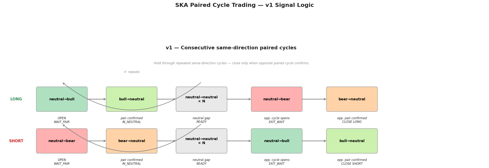

# SKA Trading Bot Results

## Framework

**Entropic Trading** — uses entropy dynamics as the signal axis instead of price.
The source of the alpha is the market's own learning process, not price levels or volume.

**Paired Cycle Trading (PCT)** — the specific strategy implemented here.
Entry and exit are defined by complete paired regime cycles in the TradeID Series.
The bot is structurally blind to the neutral→neutral baseline by design — it trades only
the 10% of transitions that carry directional information.

This is not HFT. It is event-driven structural trading — the signal fires on a topological
event (completion of a paired regime cycle), not on a threshold or a price level.




## Bot Version

### v1 — Consecutive same-direction paired cycles (current)

```
LONG:   neutral→bull              (OPEN — WAIT_PAIR)
        bull→neutral              (UP pair confirmed — IN_NEUTRAL)
        neutral→neutral × N       (neutral gap, count all — IN_NEUTRAL)
        <first non-neutral>       (gap closes — READY)
        neutral→bull              (cycle repeats — back to WAIT_PAIR)
        ...
        neutral→bear OR bear→neutral  (CLOSE — only from READY state)

SHORT:  neutral→bear              (OPEN — WAIT_PAIR)
        bear→neutral              (DOWN pair confirmed — IN_NEUTRAL)
        neutral→neutral × N       (neutral gap, count all — IN_NEUTRAL)
        <first non-neutral>       (gap closes — READY)
        neutral→bear              (cycle repeats — back to WAIT_PAIR)
        ...
        neutral→bull OR bull→neutral  (CLOSE — only from READY state)
```

State machine: WAIT_PAIR → IN_NEUTRAL → READY → (WAIT_PAIR loop or CLOSE).

The alpha: the market generates consecutive same-direction paired cycles. Hold through
all of them — close only when the first opposite-direction cycle opens.
The neutral gap (neutral→neutral × N) is counted per cycle and logged as `neutral_neutral_count`.


Live results: in progress.