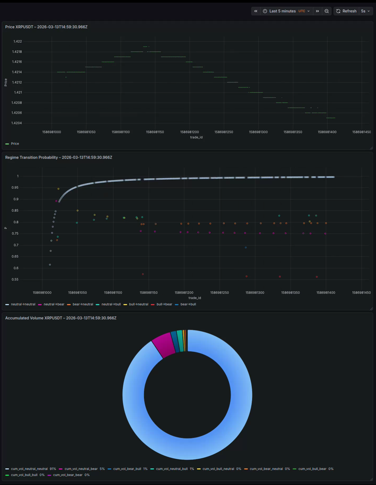
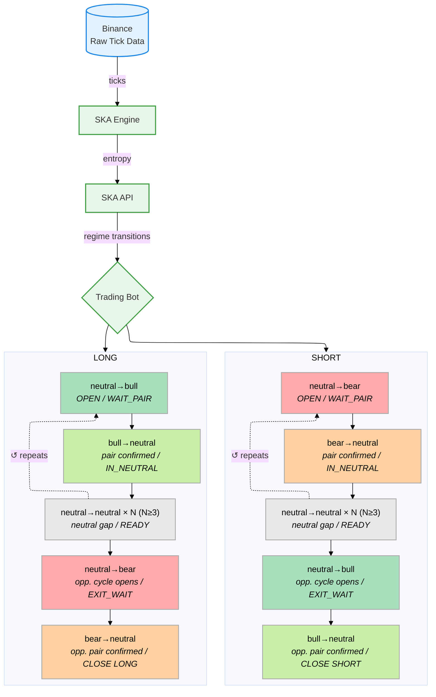

# SKA Trading Bot Results


## SKA Real-Time Dashboard — XRPUSDT Live Market Structure Analysis (Youtube)

[](https://youtu.be/01qdoMPAlB4?si=5xDByNTuGZF4gare/video)

## Framework

**Entropic Trading** — uses entropy dynamics as the signal axis instead of price.
The source of the alpha is the market's own learning process, not price levels or volume.

**Paired Cycle Trading (PCT)** — the specific strategy implemented here.
Entry and exit are defined by complete paired regime cycles in the TradeID Series.
The bot is structurally blind to the neutral→neutral baseline by design — it trades only
the 10% of transitions that carry directional information.

This is not HFT. It is event-driven structural trading — the signal fires on a topological
event (completion of a paired regime cycle), not on a threshold or a price level.


## Signal Logic — Diagram


```mermaid
---
config:
  look: classic
  theme: base
  layout: elk
---
flowchart TD
    BINANCE[(Binance <br/> Raw Tick Data)]
    ENGINE[SKA Engine]
    API["SKA API"]
    BOT@{ shape: diamond, label: "Trading Bot" }

    BINANCE -- "ticks" --> ENGINE
    API -- "regime transitions" --> BOT
    ENGINE -- "entropy" --> API

    BOT --> LONG
    BOT --> SHORT

    subgraph SHORT["SHORT"]
        direction TB
        S1["neutral→bear<br/><i>OPEN / WAIT_PAIR</i>"]
        S2["bear→neutral<br/><i>pair confirmed / IN_NEUTRAL</i>"]
        S3["neutral→neutral × N (N≥3)<br/><i>neutral gap / READY</i>"]
        S4["neutral→bull<br/><i>opp. cycle opens / EXIT_WAIT</i>"]
        S5["bull→neutral<br/><i>opp. pair confirmed / CLOSE SHORT</i>"]
        S1 --> S2 --> S3 --> S4 --> S5
        S3 -. "↺ repeats" .-> S1
    end

    subgraph LONG["LONG"]
        direction TB
        L1["neutral→bull<br/><i>OPEN / WAIT_PAIR</i>"]
        L2["bull→neutral<br/><i>pair confirmed / IN_NEUTRAL</i>"]
        L3["neutral→neutral × N (N≥3)<br/><i>neutral gap / READY</i>"]
        L4["neutral→bear<br/><i>opp. cycle opens / EXIT_WAIT</i>"]
        L5["bear→neutral<br/><i>opp. pair confirmed / CLOSE LONG</i>"]
        L1 --> L2 --> L3 --> L4 --> L5
        L3 -. "↺ repeats" .-> L1
    end

    classDef data      fill:#E3F2FD,stroke:#1E88E5,stroke-width:2px;
    classDef process   fill:#E8F5E9,stroke:#43A047,stroke-width:2px;
    classDef longOpen  fill:#A8DFBC,stroke:#AAAAAA,color:#000,stroke-width:1.5px;
    classDef longPair  fill:#C8F0A8,stroke:#AAAAAA,color:#000,stroke-width:1.5px;
    classDef shortOpen fill:#FFAAAA,stroke:#AAAAAA,color:#000,stroke-width:1.5px;
    classDef shortPair fill:#FFD0A0,stroke:#AAAAAA,color:#000,stroke-width:1.5px;
    classDef neutral   fill:#E8E8E8,stroke:#AAAAAA,color:#000,stroke-width:1.5px;

    class BINANCE data;
    class ENGINE process;
    class API,BOT process;

    class L1 longOpen;
    class L2 longPair;
    class L3 neutral;
    class L4 shortOpen;
    class L5 shortPair;
    class S1 shortOpen;
    class S2 shortPair;
    class S3 neutral;
    class S4 longOpen;
    class S5 longPair;


```

## Bot Version

### v1 — Consecutive same-direction paired cycles, symmetric exit (current)

```
LONG:   neutral→bull              (OPEN — WAIT_PAIR)
        bull→neutral              (UP pair confirmed — IN_NEUTRAL)
        neutral→neutral × N       (neutral gap, count all — IN_NEUTRAL)
        <first non-neutral>       (gap closes — READY)
        neutral→bull              (cycle repeats — back to WAIT_PAIR)
        ...
        neutral→bear              (opposite cycle opens — EXIT_WAIT)
        bear→neutral              (opposite pair confirmed — CLOSE LONG)

SHORT:  neutral→bear              (OPEN — WAIT_PAIR)
        bear→neutral              (DOWN pair confirmed — IN_NEUTRAL)
        neutral→neutral × N       (neutral gap, count all — IN_NEUTRAL)
        <first non-neutral>       (gap closes — READY)
        neutral→bear              (cycle repeats — back to WAIT_PAIR)
        ...
        neutral→bull              (opposite cycle opens — EXIT_WAIT)
        bull→neutral              (opposite pair confirmed — CLOSE SHORT)
```

State machine: WAIT_PAIR → IN_NEUTRAL → READY → EXIT_WAIT → CLOSE.

The alpha: the market generates consecutive same-direction paired cycles. Hold through
all of them — close only when the opposite paired cycle fully confirms.
Entry and exit require identical structural confirmation — a complete paired cycle.
The neutral gap (neutral→neutral × N) is counted per cycle and logged as `neutral_neutral_count`.

- All transitions processed in order (no skipping between polls)
- Full neutral gap counted per cycle (`neutral_neutral_count`)
- QuestDB state logging (`ska_bot_v1` table) with event/state/side as both int and string


### Live Results — 2026-05-18 (516 loops, XRPUSDT)  — trading_bot_v1bis

| Trades | Win% | Total PnL | Avg PnL/trade | Best | Worst | Profitable loops |
|---|---|---|---|---|---|---|
| 10,303 | 49.8% | +17,944 pips | +1.74 pips | +60 | -47 | 516/516 |

**LONG/SHORT symmetry:**
- LONG: 5,525 trades | PnL=+9,659 pips | avg=+1.75 | win=50.5%
- SHORT: 4,778 trades | PnL=+8,285 pips | avg=+1.73 | win=48.9%

