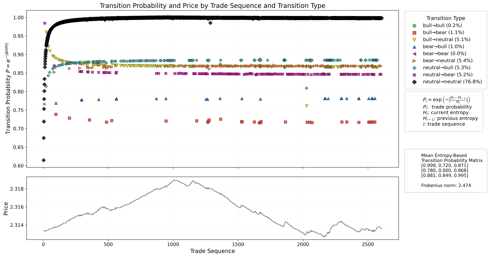

# Sample Market Data

This folder contains primary CSV files with raw trade data used for SKA-quantitative-finance research and analysis.

## Contents

- High-frequency trade/tick data samples (e.g., `questdb-query-1752003744108`)
- **Each CSV file includes the following columns:**
  - `trade_id` – unique identifier for each trade
  - `timestamp` – ISO8601 datetime of the trade
  - `price` – executed trade price (float)
  - `quantity` – traded amount (float)
  - `entropy` – computed entropy value for the trade (float)
  - `buyer_order_id` – (if available) ID of buyer participant
  - `seller_order_id` – (if available) ID of seller participant

  *(Some columns may be absent or additional columns may appear, depending on the dataset.)*

## Purpose

- Enable other researchers and quants to **replicate key figures** (entropy trajectories, regime transitions, probability bands) published in this repository
- Allow independent analysis and benchmarking using the same datasets
- With these sample data files, quantitative researchers can test and develop their own entropy-based BUY/SELL strategies, regime detection methods, or risk models—using the same high-frequency trade data and entropy measures analyzed in this project.
- Facilitate open scientific discussion and peer review

## Example Insight: Regime Cycling in Trends

The following figure, generated with SKA entropy learning from the file questdb-query-1752003744108.csv, illustrates a key market microstructure insight:

Uptrends are not composed of persistent `bull→bull` transitions. Instead, they are driven by rapid alternation between `neutral→bull` and `bull→neutral` transitions.

 This regime cycling is simultaneously visible with both price movement and entropy-based transition probability—a structure that is hard to detect with classical quant or Markov chain analysis.

**Interpretation:**

* During price uptrends (see bottom plot), the transitions with highest frequency are **neutral→bull** and **bull→neutral**.
* **Persistent “bull→bull” transitions are rare!** (As confirmed in the legend.)
* SKA’s entropy-driven, trade-by-trade visualization makes this market regime cycling explicit—revealing a universal information-processing law of market behavior.

The same cycling phenomenon is observed during downtrends, where rapid alternation between **neutral→bear** and **bear→neutral** transitions dominates the price movement.
  
* **This structure is not easily visible in classical Markov or state-count plots.**

## Background: Markov Chain and Regime-Switching Models

The standard approach in quantitative finance for modeling trends and market regimes is the **Markov chain/regime-switching model**. The canonical reference is:

> Hamilton, J.D. (1994). *Time Series Analysis*. Princeton University Press.

These models define an uptrend as a persistent run of `bull` states, detected by high self-transition probabilities (`P(bull→bull)`). Most classical quant analysis, including academic and industry research, follows this paradigm.

## Usage

- You are free to use these sample data files for academic research, non-commercial analysis, or backtesting.
- Please cite the main repository if publishing results or derivative work.

## Note

- **The real-time SKA learning code is not included in this folder.**
- Only the non real-time (batch) code is available in the [arXiv repository](https://github.com/quantiota/Arxiv).
- **Coming soon:** Real-time SKA learning will be available via an API, allowing researchers and quants to test SKA analytics on their own data streams.

