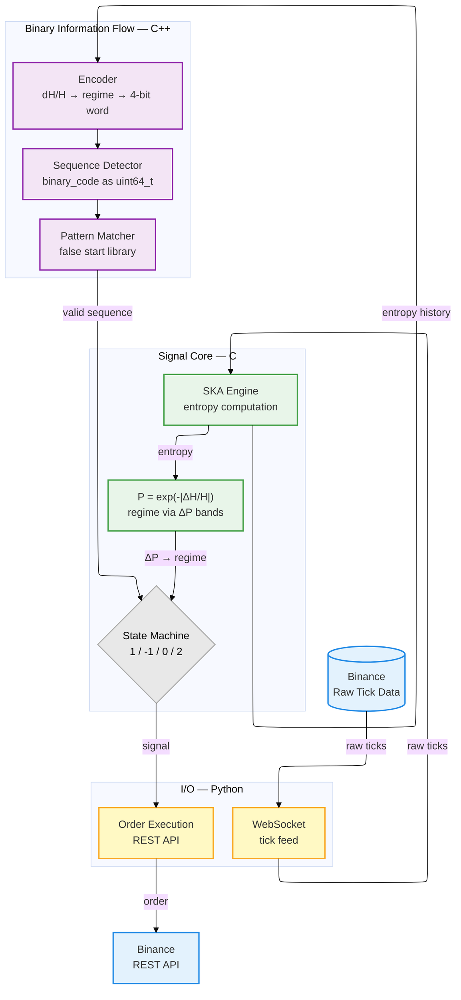

# SKA Engine C — Binary Trading Pipeline

## Concept

The SKA state machine is fundamentally a binary program:

- **LONG = 1** — bull structural cycle detected
- **SHORT = 0** — bear structural cycle detected

The entire position logic reduces to a **1-bit register** clocked by structural entropy events. The P bands are the clock — they define when the bit is valid.

The market itself is encoded as a continuous binary stream of 4-bit words — one per regime transition. Each sequence between two `neutral→neutral` boundaries is uniquely identified by its integer binary code. This is the binary information flow layer.

---

## Architecture

```
Binance WebSocket → SKA entropy → dH/H → Regime → 4-bit word → Binary stream → Pattern match → Signal core → Order API
```



Two parallel layers on the same tick stream:

| Layer | Input | Output |
|-------|-------|--------|
| Binary information flow | entropy → dH/H → regime | 4-bit words, sequences, false start detection |
| Signal core | entropy → P → ΔP bands | LONG / SHORT / HOLD / CLOSE |

---

## Layer 1 — Binary Information Flow

### Encoder

```
dH_H = (H - H_prev) / H

dH_H > 0  →  bull    (1)
dH_H < 0  →  bear    (2)
otherwise →  neutral (0)

transition_code = prev_regime × 3 + regime
4-bit word      = transition_table[transition_code]
```

### Transition table

| Code | Transition       | 4-bit word |
|------|-----------------|------------|
| 0    | neutral→neutral | `0000`     |
| 1    | neutral→bull    | `0001`     |
| 2    | neutral→bear    | `0010`     |
| 3    | bull→neutral    | `0100`     |
| 4    | bull→bull       | `0101`     |
| 5    | bull→bear       | `0110`     |
| 6    | bear→neutral    | `1000`     |
| 7    | bear→bull       | `1001`     |
| 8    | bear→bear       | `1010`     |

### Sequence

```
S = 0000 a₁ a₂ ... aₖ 0000   =   4(k+2) bits
```

A sequence opens and closes on `0000` (neutral→neutral). The binary code is the concatenation of all 4-bit words packed into a `uint64_t`. Two sequences are identical if and only if their binary codes are equal — one integer comparison.

### Pattern Matcher

```cpp
bool is_false_start(uint64_t code) {
    for (auto& pattern : library) {
        if (code == pattern.binary_code) return true;
    }
    return false;
}
```

Library loaded from `false_start_library.json` at startup (13 entries). Each comparison is O(1).

---

## Layer 2 — Signal Core

### Interface

```c
int8_t process_tick(double entropy, double delta_t, double price);
// returns:
//   1  = OPEN LONG
//  -1  = OPEN SHORT
//   0  = CLOSE
//   2  = HOLD
```

One function call per tick. ~10 CPU instructions. Zero overhead.

### Regime Detection

```c
double dP = P - prev_P;

if (fabs(dP - (-0.86)) <= 0.0042)   regime = BEAR;    // neutral→bear
else if (fabs(dP - (-0.34)) <= 0.0198) regime = BULL;  // neutral→bull
else                                   regime = NEUTRAL;
```

### State Machine

```c
typedef enum { WAIT_PAIR, IN_NEUTRAL, READY, EXIT_WAIT } State;

State long_state  = WAIT_PAIR;
State short_state = WAIT_PAIR;
int   nn_count    = 0;
```

Both LONG and SHORT machines run independently on the same tick stream.

---

## P Band Constants

Universal constants at convergence scale — asset-independent:

```c
#define P_NEUTRAL_NEUTRAL  1.00
#define P_NEUTRAL_BULL     0.66
#define P_X_NEUTRAL        0.51   // bull→neutral = bear→neutral
#define P_NEUTRAL_BEAR     0.14

#define BULL_THRESHOLD     0.34   // 1.00 - 0.66
#define BEAR_THRESHOLD     0.86   // 1.00 - 0.14

#define TOL_BEAR           0.0042  // K * 0.14
#define TOL_BULL           0.0198  // K * 0.66
#define TOL_CLOSE          0.0153  // K * 0.51
#define MIN_NN_COUNT       10
#define MIN_TRADES         50
```

---

## Python Wrapper

The wrapper retains all external system responsibilities:

- Binance WebSocket connection (`@trade` stream)
- Parse tick: `(trade_id, price, entropy, delta_t)`
- Call C library via `ctypes.CDLL`
- Receive signal (1 byte)
- Place order via Binance REST API (Ed25519 signing)
- Log to QuestDB
- Persist state to `bot_state.json`

```python
import ctypes

lib = ctypes.CDLL('./ska_bot.so')
lib.process_tick.restype = ctypes.c_int8
lib.process_tick.argtypes = [ctypes.c_double, ctypes.c_double, ctypes.c_double]

signal = lib.process_tick(entropy, delta_t, price)
```

---

## Dev Plan

### File structure

```
ska_engine_c/
├── CMakeLists.txt
├── include/
│   ├── encoder.h         # 4-bit word encoder
│   ├── sequence.h        # sequence detector + binary_code as uint64_t
│   ├── matcher.h         # pattern matcher
│   └── signal_core.h     # process_tick interface
├── src/
│   ├── encoder.cpp       # dH/H → regime → transition_code → 4-bit word
│   ├── sequence.cpp      # open/close on 0000, binary_code packing
│   ├── matcher.cpp       # load false_start_library.json, lookup
│   └── ska_bot.c         # signal core — regime detection + dual state machine
├── test/
│   ├── replay.cpp        # replay questdb_export CSV → validate sequences
│   └── cases.cpp         # unit test all 13 false start library entries
└── main.cpp              # live Binance WebSocket feed
```

### Phase 1 — Binary information flow (offline)

- Build `encoder.cpp`, `sequence.cpp`, `matcher.cpp`
- Input: `questdb_export/*.csv` — entropy column tick by tick
- Validate: sequences match known cases in `false_start_panel.md`
- Validate: all 13 library entries match themselves via `cases.cpp`

### Phase 2 — C signal core

- Implement `ska_bot.c` — regime detection via ΔP bands + dual state machine
- Compile: `gcc -shared -fPIC -o ska_bot.so ska_bot.c -lm`
- Validate against `backtest.py` results (112 loops, XRPUSDT)

### Phase 3 — Python wrapper

- Strip state machine logic from `trading_bot_v3.py`
- Replace with `ctypes` calls to `ska_bot.so`
- Validate signal output matches original bot tick-for-tick

### Phase 4 — Integration

- Run live Binance stream through both layers in parallel
- Binary information flow suppresses false starts before signal core emits
- Benchmark latency reduction (Python ms → C μs)

### Phase 5 — FPGA (future)

- Port C state machine to Verilog / VHDL
- Direct market data feed → FPGA → order signal
- Target latency: ~ns per tick

---

## Why C

| | Python bot | C library |
|---|---|---|
| State machine latency | ~ms | ~μs |
| CPU per tick | High | ~10 instructions |
| Portability | Python runtime required | Runs anywhere |
| FPGA path | No | Yes (Verilog port) |
| Code size | ~300 lines | ~50 lines |

The signal is binary. The implementation should match.
