# SKA Engine C — Binary Trading Pipeline

## Concept

The SKA state machine is fundamentally a binary program:

- **LONG = 1** — bull structural cycle detected
- **SHORT = 0** — bear structural cycle detected

The entire position logic reduces to a **1-bit register** clocked by structural entropy events. The P bands are the clock — they define when the bit is valid.

The market itself is encoded as a continuous binary stream of 4-bit words — one per regime transition. Each sequence between two `neutral→neutral` boundaries is uniquely identified by its integer binary code. This is the binary information flow layer.


## Architecture

### Epistemological Shift: Price is the Shadow

Standard quant models assume: **Price = Reality** → Indicators = Approximations of Reality

The SKA framework treats: **Entropy Transitions (4-bit words) = Reality** → Price = The Shadow cast by Reality

The market does not move price randomly; it resolves structural entropy. Price is simply the registered answer to a grammatical transition that has already occurred.

This engine does not predict price. It parses the grammar that dictates the price.


```
Float domain:  raw ticks → entropy (double) → P (double) → regime (2-bit)
                                                                  ↓
                                                            4-bit word
                                                          ↙            ↘
Bit domain:    sequence → uint64_t → matcher          State Machine → 1-bit signal
                                 false-start verdict ↗
```





The `4-bit word` arrow crossing from Signal Core into CPU Bit Processing is the float-to-bit boundary. Everything downstream of the encoder output is pure integer and state-machine logic:

| Layer | Input | Output |
|-------|-------|--------|
| Signal Core — C | raw ticks → entropy → regime → 4-bit word | signal: LONG / SHORT / HOLD / CLOSE |
| CPU Bit Processing — C++ | 4-bit word | sequence code / false-start verdict |

The state machine consumes the live 4-bit transition stream and receives a false-start verdict from the C++ matcher before emitting a trade signal.


## Layer 1 — Binary Information Flow — C++

### Sequence

```
S = 0000 a₁ a₂ ... aₖ 0000   =   4(k+2) bits
```

A sequence opens and closes on `0000` (neutral→neutral). The binary code is the concatenation of all 4-bit words packed into a `uint64_t`. Two sequences are identical if and only if their binary codes are equal — one integer comparison.

### Pattern Matcher

```cpp
std::vector<uint64_t> library;  // sorted — 1,381 × 8 bytes = ~11 KB contiguous, L1-resident

bool is_false_start(uint64_t code) {
    return std::binary_search(library.begin(), library.end(), code);  // O(log 1381) ≈ 11 comparisons
}
```

Library loaded from `config/sequence_library.json` at startup (1,381 entries). Lookup is O(log n) — 11 comparisons against a contiguous L1-resident array.


## Layer 2 — Signal Core — C

### Encoder

The encoder is implemented in C and reused by both the live signal core and the offline C++ sequence-validation pipeline.

```
dH_H = (H - H_prev) / H

dH_H > 0  →  bull    (1)
dH_H < 0  →  bear    (2)
otherwise →  neutral (0)

transition_code = prev_regime × 3 + regime
4-bit word      = transition_table[transition_code]
```

### Transition table

| Code | Transition      | 4-bit word |
|------|-----------------|------------|
| 0    | neutral-neutral | `0000`     |
| 1    | neutral-bull    | `0001`     |
| 2    | neutral-bear    | `0010`     |
| 3    | bull-neutral    | `0100`     |
| 4    | bull-bull       | `0101`     |
| 5    | bull-bear       | `0110`     |
| 6    | bear-neutral    | `1000`     |
| 7    | bear-bull       | `1001`     |
| 8    | bear-bear       | `1010`     |

### Interface

```c
int8_t process_tick(double entropy, double delta_t, double price);
// returns:
//   1  = OPEN LONG
//  -1  = OPEN SHORT
//   0  = CLOSE
//   2  = HOLD
```

One function call per tick. Minimal branching. No Python state-machine overhead.

### Regime Detection

```c
double dP = P - prev_P;

if (fabs(dP - (-0.86)) <= 0.0042)   regime = BEAR;    // neutral→bear
else if (fabs(dP - (-0.34)) <= 0.0198) regime = BULL;  // neutral→bull
else                                   regime = NEUTRAL;
```

### State Machine

```c
typedef enum {
    WAIT_PAIR,
    IN_NEUTRAL,
    READY,
    EXIT_WAIT,
    PROBE,          // V2:    bull→bear or bear→bull detected
    PROBE_EXIT,     // V2:    direct jump during EXIT_WAIT
    COMPOUND_CHECK, // V2bis: checking for neutral→neutral boundary before close
    DETOUR          // V3:    second direct jump during PROBE (double probe)
} State;

State state    = WAIT_PAIR;
int   nn_count = 0;
```

One state machine handles both LONG and SHORT. Direction is determined by the opening transition: `neutral→bull` opens LONG, `neutral→bear` opens SHORT.

### Extension Roadmap

`sequence_library.json` sorted by frequency is both the pattern matcher's input and the state machine's development roadmap. The current V3 machine natively handles ranks 1–8 (92.4% of all market activity). To extend coverage, read the next unhandled rank from the library, identify its grammar structure, and add the corresponding state. Each rank pair is always LONG + SHORT by symmetry — one new state covers both directions simultaneously. The remaining sequences are suppressed by the pattern matcher until the state machine is extended to handle them.


## P Band Constants

Universal constants at convergence scale — asset-independent:

```c
#define P_NEUTRAL_NEUTRAL  1.00
#define P_NEUTRAL_BULL     0.66
#define P_X_NEUTRAL        0.51   // bull→neutral = bear→neutral
#define P_NEUTRAL_BEAR     0.14

#define BULL_THRESHOLD     0.34   // 1.00 - 0.66
#define BEAR_THRESHOLD     0.86   // 1.00 - 0.14

#define TOL_BEAR           0.0042  // K * 0.14
#define TOL_BULL           0.0198  // K * 0.66
#define TOL_CLOSE          0.0153  // K * 0.51
#define MIN_NN_COUNT       10
#define MIN_TRADES         50
```


## Python Wrapper

Two layers:

**`ska_bot_wrapper.py`** — ctypes bridge to `libska_bot.so`:

```python
from ska_bot_wrapper import SKABot

bot = SKABot(max_buffer_size=3000, init_std=0.01)
signal = bot.tick(x_new, delta_t)
# signal: 1 = OPEN_LONG, -1 = OPEN_SHORT, 0 = CLOSE, 2 = HOLD
```

Two C calls per tick: `ska_engine_step` (entropy) → `signal_core_step` (state machine). All computation in C, Python receives a single `int8`.

**`ska_trading_bot.py`** — live Binance integration:

- Binance WebSocket connection (`@trade` stream)
- Price return → sigmoid: `x = σ(Δp/p × 100 × scale)`
- `SKABot.tick(x, delta_t)` → signal
- Order execution via Binance REST API (Ed25519 signing)
- CSV signal logging

```bash
python3 ska_trading_bot.py                    # dry run, XRPUSDT
python3 ska_trading_bot.py --symbol BTCUSDT   # different asset
python3 ska_trading_bot.py --live             # real orders
```


## Dev Plan

### File structure

```
source/
├── CMakeLists.txt
├── config/
│   └── sequence_library.json   # 1,381 sequences ranked by frequency — ~11 KB
├── include/
│   ├── ska_engine.h      # SKA learning engine interface (C)
│   ├── encoder.h         # 4-bit word encoder            (C)
│   ├── sequence.h        # sequence detector              (C++)
│   ├── matcher.h         # pattern matcher                (C++)
│   ├── matcher_api.h     # extern "C" bridge for ska_bot.c integration
│   └── signal_core.h     # signal core interface          (C)
├── src/
│   ├── ska_engine.c      # SKA learning engine — weight updates, entropy
│   ├── encoder.c         # dH/H → regime → transition_code → 4-bit word
│   ├── sequence.cpp      # open/close on 0000, binary_code as uint64_t
│   ├── matcher.cpp       # load config/sequence_library.json, O(log n) lookup
│   └── ska_bot.c         # regime detection + V3 directional state machine → 1-bit signal
├── python/
│   ├── ska_bot_wrapper.py    # ctypes bridge to libska_bot.so
│   └── ska_trading_bot.py    # Binance WebSocket → C engine → signals/orders
├── test/
│   ├── test_ska_engine.c     # Phase 1 tests
│   ├── test_phase2.cpp       # Phase 2 tests
│   ├── test_phase3.c         # Phase 3 tests
│   ├── test_phase4.py        # Phase 4 tests
│   └── validate.py           # tick-by-tick entropy match vs Python
└── build/
    └── libska_bot.so         # combined library (ska_engine + encoder + signal core)
```

### Phase 1 — SKA learning engine — C


- Implement `ska_engine.c` — weight updates, entropy computation
- Validate entropy output matches Python engine tick-for-tick

### Phase 2 — Binary information flow (offline)


- Build `encoder.c`, `sequence.cpp`, `matcher.cpp`
- Input: `questdb_export/*.csv` — entropy column tick by tick
- Validate: sequences match known cases in `false_start_panel.md`
- Validate: all 1,381 sequence library entries match themselves via `cases.cpp`

### Phase 3 — C signal core


- Implement `ska_bot.c` — regime detection via ΔP bands + V3 state machine (8 states: WAIT_PAIR, IN_NEUTRAL, READY, EXIT_WAIT, PROBE, PROBE_EXIT, COMPOUND_CHECK, DETOUR)
- Coverage: 92.4% of all market sequences (ranks 1–8)
- Compile: `gcc -shared -fPIC -o ska_bot.so ska_bot.c -lm`
- Validate against `backtest.py` results (112 loops, XRPUSDT)

### Phase 4 — Python wrapper


- Strip state machine logic from `trading_bot_v3.py`
- Replace with `ctypes` calls to `ska_bot.so`
- Validate signal output matches original bot tick-for-tick

### Phase 5 — Integration


- Run live Binance stream through both layers in parallel
- Binary information flow suppresses false starts before signal core emits
- Benchmark latency reduction (Python ms → C μs)

### Phase 6 — FPGA (future)

- Port C state machine to Verilog / VHDL
- Direct market data feed → FPGA → order signal
- Target latency: ~ns per tick


## Why C and C++

| | Python bot | C (SKA + Signal Core) | C++ (Bit Processing) |
|---|---|---|---|
| Latency | ~ms | ~μs | ~μs |
| CPU per tick | High | constant-time state update | ~11 comparisons |
| Data type | float / object | double → 2-bit | uint64_t |
| STL required | No | No | Yes (vector, binary_search) |
| FPGA path | No | Yes (Verilog port) | Rewrite required |
| Code size | ~300 lines | ~200 lines | ~110 lines |

The signal is binary. The implementation should match.

