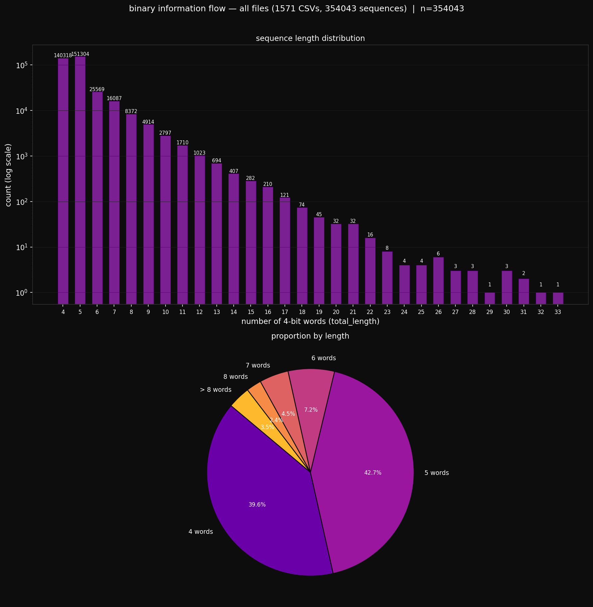

# Binary Transition Space

We believe—like John Archibald Wheeler—that the ultimate foundation of reality is information:

> "It from bit symbolizes the idea that every item of the physical world has at bottom—a very deep bottom, in most instances—an immaterial source and explanation; that what we call reality arises, in the last analysis, from the posing of yes-no questions and the registering of equipment-evoked responses; in short, that all things physical are information-theoretic in origin and that this is a participatory universe."

*John Archibald Wheeler, "Information, Physics, Quantum: The Search for Links" (1989/1990).*


## State Encoding

| State   | Code |
|---------|------|
| neutral | `00` |
| bull    | `01` |
| bear    | `10` |

Code `11` is undefined and never occurs.

---

## Transition Encoding

A transition A→B is a **4-bit word** `[a₁a₀b₁b₀]` (from-state | to-state):

The index is `prev_regime × 3 + regime` where `neutral=0, bull=1, bear=2`:

| Index | Transition       | 4-bit word |
|-------|-----------------|------------|
| 0     | neutral→neutral | `0000`     |
| 1     | neutral→bull    | `0001`     |
| 2     | neutral→bear    | `0010`     |
| 3     | bull→neutral    | `0100`     |
| 4     | bull→bull       | `0101`     | — never observed |
| 5     | bull→bear       | `0110`     |
| 6     | bear→neutral    | `1000`     |
| 7     | bear→bull       | `1001`     |
| 8     | bear→bear       | `1010`     | — never observed |


## Sequence

A sequence `S` is the ordered list of 4-bit words including its `0000` (neutral→neutral) boundaries:

```
S = 0000 a₁ a₂ ... aₖ 0000
```

where each `aᵢ` is a 4-bit transition word and every consecutive pair composes.

The binary code of `S` is the concatenation of all its 4-bit words:

```
code(S) = 0000 a₁ a₂ ... aₖ 0000  =  4(k+2) bits
```

Two sequences are identical if and only if their binary codes are equal. The code is the complete, unambiguous identity of the episode — independent of time, price, and asset.


## Binary Information Flow

The entire market is a continuous binary stream of 4-bit words:

```
... 0000 0000 0000 0010 1000 0001 0100 0010 1001 0100 0000 0000 0001 0100 0000 0000 0010 1001 0110 1001 0100 0000 0000 0000 ...
```

- `0000` — neutral→neutral (silence between episodes)
- any other word — regime transition (episode content)


## Binary Transition Space — Analysis

Converts QuestDB CSV exports to binary information flow and plots the sequence length distribution.

---

### Pipeline

```
questdb_export/*.csv → encoder → sequence detector → binary_code (uint64) → distribution plot
```


### Scripts

#### `csv_to_binary_flow.py`

Reads tick data CSVs and produces:
- `*_stream.csv` — one row per tick: `trade_id, timestamp, regime, transition_code, transition_name, word, dh_h`
- `*_sequences.csv` — one row per sequence: `trade_id_open, trade_id_close, inner_length, total_length, binary_code_str, binary_code_int`

```bash
# single file
python3 csv_to_binary_flow.py --csv /path/to/file.csv

# full directory
python3 csv_to_binary_flow.py --input /path/to/questdb_export --output /path/to/output
```

#### `plot_binary_flow.py`

Plots sequence length distribution: bar chart (log scale) + pie chart.

```bash
# single sequence file
python3 plot_binary_flow.py --csv /path/to/sequences.csv

# all sequence files in output directory
python3 plot_binary_flow.py
```


### Result



**1,571 CSV files — 356,528 sequences**

- 4-word sequences: 77.7%
- 5-word sequences: 8.5%
- Together: **86.2%** of all sequences
- Hard cutoff at 33 words

The distribution is **not random**. The market selects specific sequence lengths with high probability. Short sequences (4–5 words) are the natural structural unit of market information.


### Observed sequences — 1,571 CSV files

#### 4-word sequences — 2 distinct

```
count: 139,507  integer: 320   delta_pips: +1
0000(neutral-neutral)  0001(neutral-bull)  0100(bull-neutral)  0000(neutral-neutral)

count: 137,537  integer: 640   delta_pips: -1
0000(neutral-neutral)  0010(neutral-bear)  1000(bear-neutral)  0000(neutral-neutral)
```

#### 5-word sequences — 4 distinct

```
count: 15,812  integer: 10560  delta_pips:  0
0000(neutral-neutral)  0010(neutral-bear)  1001(bear-bull)  0100(bull-neutral)  0000(neutral-neutral)

count: 14,468  integer: 5760   delta_pips:  0
0000(neutral-neutral)  0001(neutral-bull)  0110(bull-bear)  1000(bear-neutral)  0000(neutral-neutral)

count: 106     integer: 5440   delta_pips: +2
0000(neutral-neutral)  0001(neutral-bull)  0101(bull-bull)  0100(bull-neutral)  0000(neutral-neutral)

count: 105     integer: 10880  delta_pips: -2
0000(neutral-neutral)  0010(neutral-bear)  1010(bear-bear)  1000(bear-neutral)  0000(neutral-neutral)
```

### Structural role of the 5-word reversal sequences

The two dominant 5-word sequences (integers 5760 and 10560, delta_pips=0) represent **8.5% of all sequences** across 1,571 loops:

```
neutral-bull → bull-bear → bear-neutral   (tried up, rejected, returned)
neutral-bear → bear-bull → bull-neutral   (tried down, rejected, returned)
```

They are the market's **directional probe** — a test with no commitment.

The market asks a binary question: "is there sustained demand in this direction?" The cross-transition is the answer: **no**. The sequence closes at delta_pips=0 — no structural direction was established, but the question had to be asked.

Without these sequences the market would only produce clean LONG and SHORT pairs. That is impossible — to find the price where supply meets demand, the market must probe both sides and retract when rejected.

| sequence type | delta_pips | role |
|---|---|---|
| 4-word (77.7%) | ±1 | commitment — direction established |
| 5-word reversal (8.5%) | 0 | rejection — direction tested and refused |

From Wheeler's "It from Bit": the reversal sequence encodes one bit — "this direction has no structural support at this moment." The sequence must exist for the market to learn that answer. They are the market's self-correction mechanism between trends.


### The integer as a structural key

Each sequence is uniquely identified by a single `uint64` integer — `binary_code_int`. This has two direct applications.

#### Memory operations

Pattern matching reduces to one integer comparison:

```cpp
bool is_known(uint64_t code) {
    return library.count(code) > 0;  // O(1)
}
```

- The full sequence library (1,381 entries) fits in L1 cache as a sorted array — ~10 comparisons to locate any sequence
- No string parsing, no word-by-word iteration — one equality check replaces the entire sequence comparison

Two market events are structurally identical **if and only if their integers are equal**.

#### Historical archiving

One loop produces ~3,500 ticks and ~273 sequences. At the integer level:

```
3,500 ticks  →  273 uint64 integers
```

The integer stream is lossless at the structural level: the full transition path can be reconstructed from the integer by reversing the 4-bit packing. A year of tick data becomes a compact stream of integers — queryable by pattern, not by price.


## Possible sequences — theoretical count

With self-loops (`0101` bull→bull, `1010` bear→bear) sequences can be arbitrarily long. The number of valid distinct sequences of exactly k inner words follows the recurrence:

$$f(k) = 2f(k-1) + 2f(k-2)$$

| inner words | distinct sequences |
|---|---|
| 2 | 2 |
| 3 | 4 |
| 4 | 12 |
| 5 | 32 |
| 6 | 88 |
| 7 | 240 |
| 8 | 656 |
| 9 | 1,792 |
| 10 | 4,896 |
| 11 | 13,376 |
| 12 | 36,544 |
| 13 | 99,840 |
| 14 | 272,768 |

The total number of theoretically possible distinct sequences up to 16 total words (uint64 limit) exceeds **430,000**.

The market uses **1,381**.

Less than 1% of the grammatical space is explored. The market speaks a highly selective, concentrated language — not random, not exhaustive.
